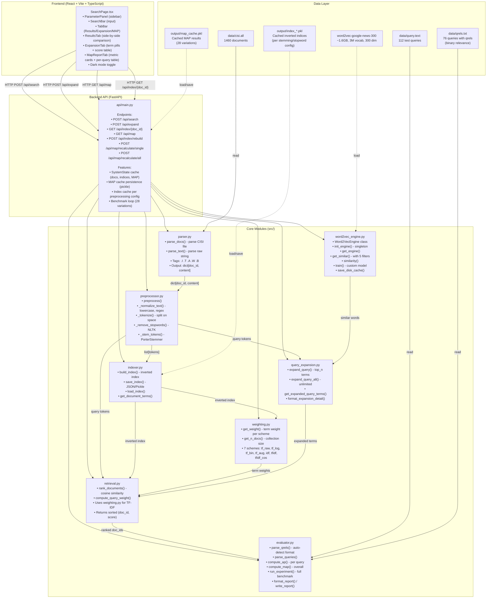

# Information Retrieval System with Word2Vec Query Expansion

<p align="center">
  <a href="https://www.python.org/">
    
  </a>
  <a href="https://fastapi.tiangolo.com/">
    
  </a>
  <a href="https://radimrehurek.com/gensim/">
    
  </a>
  <a href="https://www.nltk.org/">
    
  </a>
  <a href="https://react.dev/">
    
  </a>
  <a href="https://www.typescriptlang.org/">
    
  </a>
  <a href="https://vite.dev/">
    
  </a>
  <a href="https://tailwindcss.com/">
    
  </a>
</p>

## Description

This application implements an **Information Retrieval (IR) System** using the Vector Space Model (VSM) and integrates a **Word2Vec Query Expansion** engine. Users can query a collection of documents using standard search terms, and the system automatically suggests semantically similar terms to broaden the search query, retrieving more relevant documents that do not necessarily contain the exact original keywords.

### How it Works:
1. **Document Preprocessing**: Texts are normalized (lowercased, punctuation removed), tokenized, and optionally filtered for stopwords (NLTK stopwords) and stemmed (NLTK Porter Stemmer).
2. **Indexing**: An inverted index is constructed dynamically based on the active preprocessing settings.
3. **Weighting Schemes**: Supports 7 different TF-IDF weighting schemes:
   - `tf_raw` (Raw term frequency)
   - `tf_log` (Logarithmic term frequency)
   - `tf_bin` (Binary term frequency)
   - `tf_aug` (Augmented term frequency)
   - `idf` (Inverse document frequency)
   - `tfidf` (Standard TF-IDF)
   - `tfidf_cos` (TF-IDF with Cosine Normalization)
4. **Query Expansion (Word2Vec)**: Leverages a 300-dimension Google News pre-trained Word2Vec model. It extracts the top-N semantically similar terms using cosine similarity in the vector space, filters out noise (lowercase filter, length check, subword duplicates), and appends them to the search query.
5. **Retrieval & Side-by-Side Comparison**: Searches the index using both the original and expanded queries. The frontend displays the results side-by-side, highlighting documents whose rankings improved as a result of query expansion.
6. **MAP (Mean Average Precision) Evaluation**: Performs offline benchmarks evaluating all 112 queries against relevance judgments (`qrels`) for **28 combinations** of parameters (2 stemming states × 2 stopword states × 7 weighting schemes). Shows exact Average Precision (AP) per query.

### System Architecture



---

## Table of Contents

1. [Description](#description)
2. [Setup & Dependencies](#setup--dependencies)
   - [Prerequisites](#prerequisites)
   - [Backend Installation](#1-backend-installation)
   - [Frontend Installation](#2-frontend-installation)
3. [How to Run](#how-to-run)
   - [Running the Backend API Server](#1-running-the-backend-api-server)
   - [Running the Frontend Dev Server](#2-running-the-frontend-dev-server)
   - [Running CLI Experiments/Evaluator](#3-running-cli-experiments-evaluator)
4. [Creators](#creators)

---

## Setup & Dependencies

### Prerequisites
- **Python 3.13+** installed.
- **Node.js 18+** installed.
- Recommended Python package manager: **`uv`** (Astral's fast Python packaging tool).

---

### 1. Backend Installation

1. Clone this repository and navigate to the project directory:
   ```bash
   git clone https://github.com/salmaanhaniif/InformationRetrievalSystem-Word2Vec.git
   cd InformationRetrievalSystem-Word2Vec
   ```

2. Sync/install Python dependencies:
   * Using `uv` (recommended):
     ```bash
     uv sync
     ```
   * Using `pip` (alternative):
     ```bash
     pip install -r requirements.txt
     ```

3. **CRITICAL STEP**: Download the NLTK stopword corpora:
   * Using `uv`:
     ```bash
     uv run python -c "import nltk; nltk.download('stopwords')"
     ```
   * Using standard Python:
     ```bash
     python -c "import nltk; nltk.download('stopwords')"
     ```

---

### 2. Frontend Installation

1. Navigate to the `frontend` folder:
   ```bash
   cd frontend
   ```

2. Install dependencies:
   ```bash
   npm install
   ```

3. Return to the root folder:
   ```bash
   cd ..
   ```

---

## How to Run

Running the application requires launching both the **Backend API Server** and the **Frontend React Client**.

### 1. Running the Backend API Server

Open a terminal at the project root and run:
* Using `uv`:
  ```bash
  uv run uvicorn api.main:app --reload --host 0.0.0.0 --port 8000
  ```
* Using standard python:
  ```bash
  python -m uvicorn api.main:app --reload --host 0.0.0.0 --port 8000
  ```

> [!NOTE]
> **First Run Behaviour:**
> - The backend will automatically download the ~1.6 GB pre-trained `word2vec-google-news-300` model using Gensim API if it is not already present.
> - The server will automatically perform benchmark calculations for all 28 parameter combinations (which takes a few minutes).
> - All results and index matrices are saved in `output/` so that subsequent startups are nearly instantaneous.

You can inspect the backend API docs via Swagger UI at [http://localhost:8000/docs](http://localhost:8000/docs).

---

### 2. Running the Frontend Dev Server

Open a second terminal window, navigate to the `frontend/` directory, and start the development server:
```bash
cd frontend
npm run dev
```

Open your web browser and go to **[http://localhost:5173](http://localhost:5173)** to interact with the search panel, adjust weights/stemming, and inspect MAP reports.

---

### 3. Running CLI Experiments / Evaluator

To run the offline evaluator directly in the console and export the evaluation metrics without launching the web application:
* Using `uv`:
  ```bash
  uv run python -m src.evaluator
  ```
* Using standard python:
  ```bash
  python -m src.evaluator
  ```

This outputs a summary of Mean Average Precision (MAP) metrics and writes a complete breakdown report per query to `map_report.txt`.

---

## Creators

<table>
    <tr align="left">
        <td><b>NIM</b></td>
        <td><b>Name</b></td>
        <td align="center"><b>GitHub</b></td>
    </tr>
    <tr align="left">
        <td>13523017</td>
        <td>Orvin Andika Ikhsan Abhista</td>
        <td align="center" >
            <div style="margin-right: 20px;">
            <a href="https://github.com/orvin14" >
                 
                <br/> <sub><b> @orvin14 </b></sub>
            </a><br/>
            </div>
        </td>
    </tr>
    <tr align="left">
        <td>13523100</td>
        <td>Aryo Wisanggeni</td>
        <td align="center" >
            <div style="margin-right: 20px;">
            <a href="https://github.com/Staryo40" >
                 
                <br/> <sub><b> @Staryo40 </b></sub>
            </a><br/>
            </div>
        </td>
    </tr>
    <tr align="left">
        <td>13523027</td>
        <td>Fajar Kurniawan</td>
        <td align="center" >
            <div style="margin-right: 20px;">
            <a href="https://github.com/Fajar2k5" >
                 
                <br/> <sub><b> @Fajar2k5 </b></sub>
            </a><br/>
            </div>
        </td>
    </tr>
    <tr align="left">
        <td>13523056</td>
        <td>Salman Hanif</td>
        <td align="center" >
            <div style="margin-right: 20px;">
            <a href="https://github.com/salmaanhaniif" >
                 
                <br/> <sub><b> @salmaanhaniif </b></sub>
            </a><br/>
            </div>
        </td>
    </tr>
    <tr align="left">
        <td>13523072</td>
        <td>Sabilul Huda</td>
        <td align="center" >
            <div style="margin-right: 20px;">
            <a href="https://github.com/bill2247" >
                 
                <br/> <sub><b> @bill2247 </b></sub>
            </a><br/>
            </div>
        </td>
    </tr>
</table>
